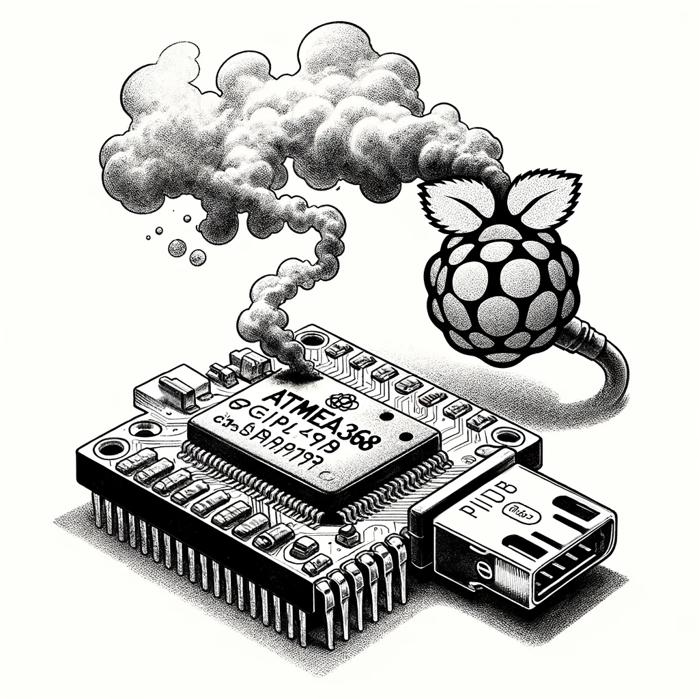

# AVR Burner

DALL-E: "please create a black and white sketch of a chip labeld Atmega368 with a thin smoke cloud and an attached Raspberry Pi"



TL;DR: `python3 app.py` - open [`http://localhost:5001`](http://localhost:5001) in your browser.

The "AVR Burner" can be used to:

* Read the fuses of an ATmega328P, or
* flash a hex file to an ATmega328P.

Under the hood we use `avrdude` and a `usbasp` programmer.

Pre-requisites:

* `avrdude` installed, and
* `usbasp` programmer connected to the ATmega328P and the host (Raspberry Pi).

## Setup

```shell
sudo apt-get install avrdude -y
```

## (manually) Check the Fuses

Read the fuses to stdout:

```shell
avrdude -c usbasp -p m328p -U lfuse:r:-:h -U hfuse:r:-:h -U efuse:r:-:h
```

read the fuses from the ATmega328P and write the (hex) values to files:

```shell
avrdude -c usbasp -p m328p -U lfuse:r:low_fuse.hex:h -U hfuse:r:high_fuse.hex:h -U efuse:r:extended_fuse.hex:h
```

> Tip: On linux you might need to use `sudo` or check the permissions on the USB device, if you encounter: `error sending control message: Operation not permitted`.

## Known Issues

* [ ] (copilot) The `avrdude` command is executed as `root` (via `sudo`), which is not ideal.
* [ ] (copilot) The `avrdude` command is executed synchronously, which is not ideal.
* [ ] The `avrdude` command is executed with a fixed set of parameters, which is not ideal (`-B 125kHz` required, for "cheap" USBasp devices).
